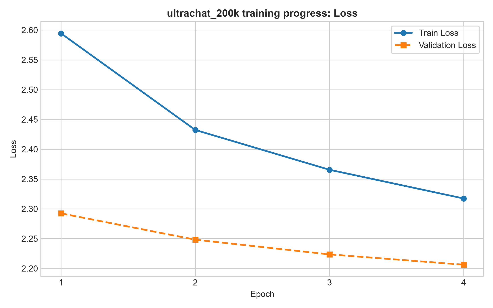
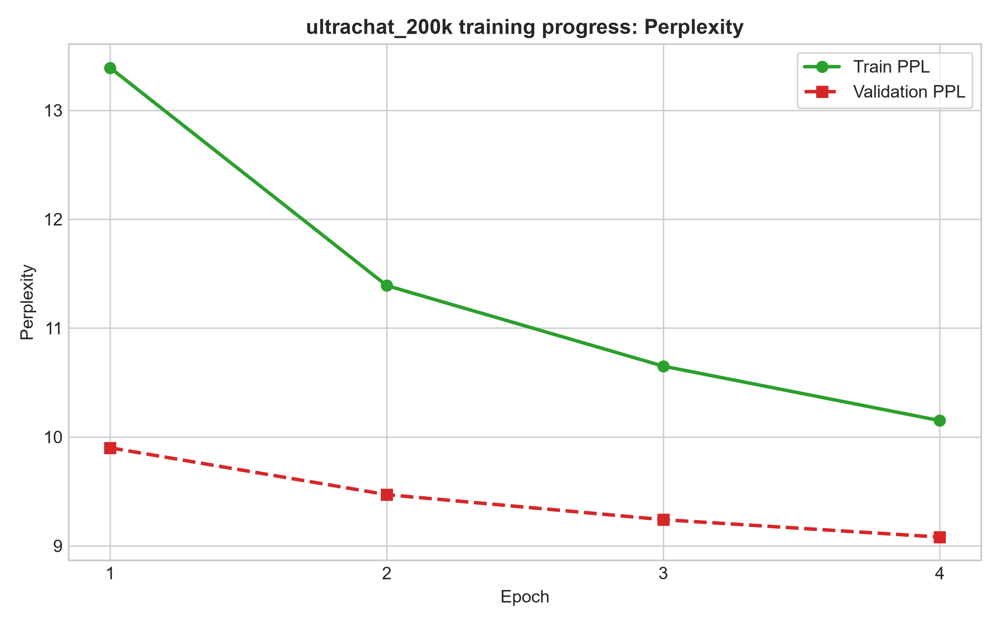

# GPT-2 Instruct Model v0.6 Fine-tuning

This is **v0.6** of the GPT-2 Instruct model, a continued fine-tuning of [FurkanNar/GPT-2_Instruct-v0.5](https://huggingface.co/FurkanNar/GPT-2_Instruct-v0.5) on the [HuggingFaceH4/ultrachat_200k](https://huggingface.co/datasets/HuggingFaceH4/ultrachat_200k) dataset for improved instruction-following capabilities.

## Model & Dataset

- **Base Model**: [FurkanNar/GPT-2_Instruct-v0.5](https://huggingface.co/FurkanNar/GPT-2_Instruct-v0.5)
- **Training Dataset**: This version (v0.6) was trained on **HuggingFaceH4/ultrachat_200k** - A large-scale multi-turn conversation dataset for instruction following
- **Previous Training**: v0.5 was trained on Alpaca, SVAMP, and Dolly-15k datasets

## Training Hyperparameters

| Parameter | Value |
|-----------|-------|
| Tokenizer | gpt2 |
| Dataset | HuggingFaceH4/ultrachat_200k (10,000 train samples, 1,000 test samples) |
| Max Sequence Length | 512 tokens |
| Epochs | 4 |
| Batch Size | 8 |
| Learning Rate | 2e-5 (AdamW optimizer) |
| Max Gradient Norm | 1.0 (gradient clipping) |
| Precision | Mixed Precision (FP16) via torch.cuda.amp autocasting |

## Training Results

### Epoch Summaries

| Epoch | Train Loss | Train Perplexity | Val Loss | Val Perplexity |
|-------|------------|------------------|----------|----------------|
| 1 | 2.5944 | 13.39 | 2.2924 | 9.90 |
| 2 | 2.4324 | 11.39 | 2.2483 | 9.47 |
| 3 | 2.3656 | 10.65 | 2.2236 | 9.24 |
| 4 | 2.3174 | 10.15 | 2.2063 | 9.08 |

### Loss Progress



The model shows consistent improvement in both training and validation loss across all epochs. The validation loss decreases from 2.2924 to 2.2063, indicating the model is learning effectively without significant overfitting.

### Perplexity Progress



Perplexity follows a similar downward trend, with training perplexity dropping from 13.39 to 10.15 and validation perplexity from 9.90 to 9.08. The narrow gap between training and validation perplexity suggests the model is generalizing well.

## Model Artifacts

The trained model is saved locally in the `saved_model/` directory:
- `model.safetensors` - Model weights in safetensors format
- `config.json` - Model configuration
- `generation_config.json` - Generation parameters

## Training Configuration

The training script includes several optimizations for memory efficiency:
- Mixed precision training (FP16) to reduce memory usage
- Gradient clipping to prevent exploding gradients
- Memory fragmentation reduction via `PYTORCH_CUDA_ALLOC_CONF=expandable_segments:True`

## Inference

The model uses a sophisticated **Best-of-N sampling** approach with multiple advanced techniques for high-quality generation:

### Generation Method

- **Parallel Batched Generation**: Generates N candidates (default N=4) in parallel via GPU batching for efficiency
- **Length-Normalized Log-Likelihood Scoring**: Each candidate is scored using temperature-scaled logits, computing the geometric mean of token probabilities normalized by sequence length to eliminate short-response bias
- **Calibrated Confidence Selection**: Uses a separate calibration temperature (T_calib=0.8) for scoring, independent from generation temperature (T_gen=0.7), allowing separate control over exploration and confidence estimation

### Sampling Parameters

| Parameter | Value | Description |
|-----------|-------|-------------|
| Generation Temperature | 0.7   | Controls randomness during candidate generation |
| Calibration Temperature | 0.8    | Scales logits for confidence scoring |
| Top-K | 40    | Limits sampling to top K tokens per position |
| Top-P (Nucleus) | 0.9   | Cumulative probability threshold for sampling |
| Repetition Penalty | 1.15  | Penalizes repeated tokens to reduce redundancy |
| Best-of-N | 4     | Number of candidate responses to sample and score per turn |
| Max New Tokens | 256   | Maximum response length |
| Max Length | 512   | Maximum sequence length (input + output) |

### Multi-Turn Conversation

- **Conversation History**: Maintains turn-by-turn history using Dolly-15k/Alpaca format with "Instruction:" and "Response:" tags
- **Context Management**: Automatically truncates earlier conversation turns when context exceeds max_length (512 tokens)
- **Stop Sequences**: Custom stopping criteria prevent over-generation by detecting sequences like "\nInstruction:", "\nResponse:", "\nUser:", etc.

### Example Output

```
You: How to make a salad

--- Best-of-4 Candidate Scores ---
   Candidate 1: Log-Likelihood = -0.7616 | Geom Mean Prob = 46.7% (171 tokens)
   Candidate 2: Log-Likelihood = -0.9515 | Geom Mean Prob = 38.6% (148 tokens)
   Candidate 3: Log-Likelihood = -0.9907 | Geom Mean Prob = 37.1% (172 tokens)
 * Candidate 4: Log-Likelihood = -0.7411 | Geom Mean Prob = 47.7% (172 tokens)
-------------------------------------------------------
AI: Here's an easy way to make salad: 

1. Start with a small bowl of water. 2. Add diced tomatoes and cucumber to it. 3. Mix in a pinch for taste. 4. Add salt or pepper if desired. 5. Pour the dressing over the vegetables before adding them to salads. 6. Serve hot and enjoy!

You: How to read a book effectively

--- Best-of-4 Candidate Scores ---
   Candidate 1: Log-Likelihood = -0.9790 | Geom Mean Prob = 37.6% (256 tokens)
   Candidate 2: Log-Likelihood = -0.9396 | Geom Mean Prob = 39.1% (256 tokens)
   Candidate 3: Log-Likelihood = -1.0409 | Geom Mean Prob = 35.3% (256 tokens)
 * Candidate 4: Log-Likelihood = -0.8596 | Geom Mean Prob = 42.3% (204 tokens)
-------------------------------------------------------
AI: Reading books can be a powerful tool for learning about mathematics concepts. Here are some tips on how to read books effectively:

- Read a book: You can read books online and look for specific topics that you need help with.
- Look up relevant sources: You may find books online that are suitable for reading.
```

### Known Weaknesses

- **Tight Clusters**: The model may generate similar responses across candidates, especially when the training data has limited diversity in certain domains. This can reduce the effectiveness of the Best-of-4 method when candidates are too similar.

- **GPT-2 Base Knowledge Limitations**: Since this model is based on GPT-2 (124M parameters), it has inherent limitations in base knowledge compared to larger models like GPT-3 or GPT-4. The model may:
  - Struggle with complex reasoning tasks
  - Have limited world knowledge and factual accuracy
  - Produce hallucinations or incorrect information
  - Have difficulty with specialized domains not well-represented in the training data

- **Sequence Length Constraint**: The model is trained with a max sequence length of 512 tokens, which limits the length and complexity of responses it can generate effectively.