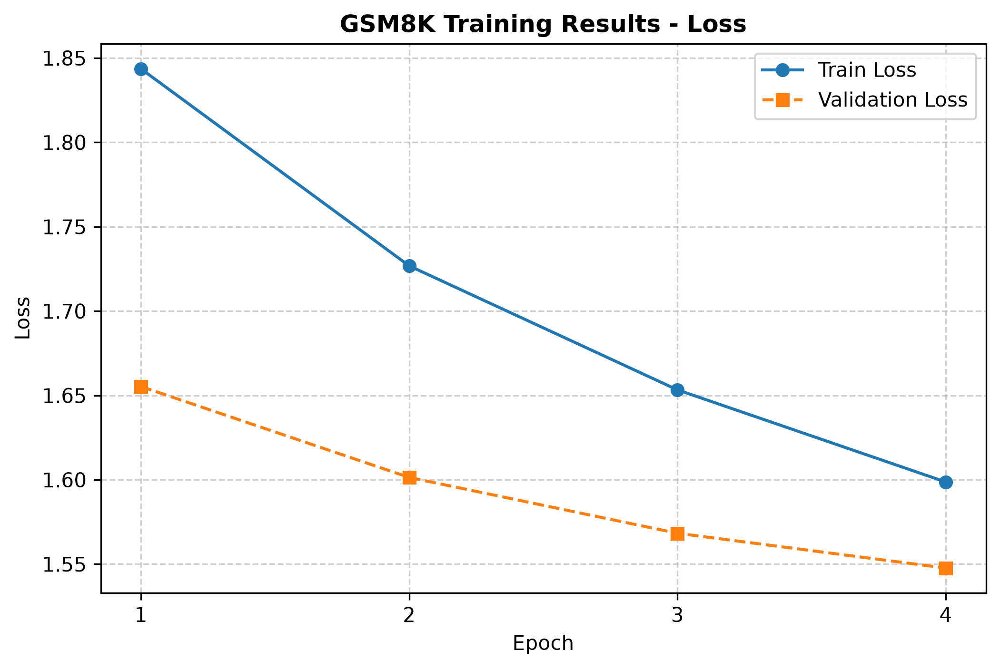
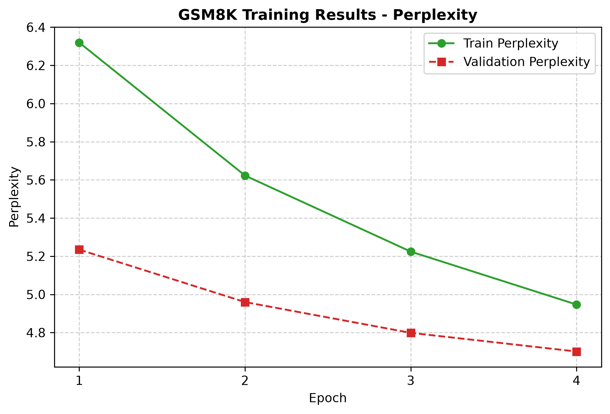

# GPT-2 Instruct Model Fine-tuning (Version 0.6)

This project continues fine-tuning the GPT-2 model from [FurkanNar/GPT-2_Instruct-v0.5](https://huggingface.co/FurkanNar/GPT-2_Instruct-v0.5) on the GSM8K dataset for mathematical reasoning tasks.

## Model & Dataset

- **Base Model**: [openai-community/gpt2](https://huggingface.co/openai-community/gpt2)
- **Training Dataset**: [openai/gsm8k](https://huggingface.co/datasets/openai/gsm8k) - Grade school math word problems
- **Architecture**: GPT2LMHeadModel
- **Tokenizer**: GPT2 tokenizer
- **Criterion**: Cross entropy loss

## Training Hyperparameters

| Parameter | Value |
|-----------|-------|
| Epochs | 4 |
| Batch Size | 8 |
| Learning Rate | 2e-5 |
| Max Gradient Norm | 1.0 |
| Max Sequence Length | 512 tokens |
| Mixed Precision | FP16 (enabled) |
| Tokenizer | GPT2 |
| Architecture | GPT2LMHeadModel |
| Criterion | Cross entropy loss |
| Dataset | openai/gsm8k |

## Training Results

### Epoch Summaries

| Epoch | Train Loss | Train Perplexity | Val Loss | Val Perplexity |
| :--- | :--- | :--- | :--- | :--- |
| **Epoch 1** | 1.8436 | 6.3195 | 1.6553 | 5.2347 |
| **Epoch 2** | 1.7268 | 5.6227 | 1.6014 | 4.9598 |
| **Epoch 3** | 1.6533 | 5.2241 | 1.5683 | 4.7985 |
| **Epoch 4** | 1.5987 | 4.9468 | 1.5477 | 4.7007 |

### Loss Progress



The model shows consistent improvement in both training and validation loss across all epochs. The validation loss decreases from 1.6553 to 1.5477, indicating the model is learning effectively without significant overfitting.

### Perplexity Progress



Perplexity follows a similar downward trend, with training perplexity dropping from 6.32 to 4.95 and validation perplexity from 5.23 to 4.70. The narrowing gap between training and validation perplexity suggests the model is generalizing well.

## Model Artifacts

The trained model is saved locally in the `saved_model/` directory:
- `model.safetensors` - Model weights in safetensors format
- `config.json` - Model configuration
- `generation_config.json` - Generation parameters

## Training Configuration

The training script includes several optimizations for memory efficiency:
- Mixed precision training (FP16) to reduce memory usage
- Gradient clipping to prevent exploding gradients
- Memory fragmentation reduction via `PYTORCH_CUDA_ALLOC_CONF=expandable_segments:True`

## Inference

The model uses a sophisticated **Best-of-N sampling** approach with multiple advanced techniques for high-quality generation:

### Generation Method

- **Parallel Batched Generation**: Generates N candidates (default N=4) in parallel via GPU batching for efficiency
- **Length-Normalized Log-Likelihood Scoring**: Each candidate is scored using temperature-scaled logits, computing the geometric mean of token probabilities normalized by sequence length to eliminate short-response bias
- **Calibrated Confidence Selection**: Uses a separate calibration temperature (T_calib=0.8) for scoring, independent from generation temperature (T_gen=0.7), allowing separate control over exploration and confidence estimation

### Sampling Parameters

| Parameter | Value | Description |
|-----------|-------|-------------|
| Generation Temperature | 0.7   | Controls randomness during candidate generation |
| Calibration Temperature | 0.8    | Scales logits for confidence scoring |
| Top-K | 40    | Limits sampling to top K tokens per position |
| Top-P (Nucleus) | 0.9   | Cumulative probability threshold for sampling |
| Repetition Penalty | 1.15  | Penalizes repeated tokens to reduce redundancy |
| Best-of-N | 4     | Number of candidate responses to sample and score per turn |
| Max New Tokens | 256   | Maximum response length |

### Multi-Turn Conversation

- **Conversation History**: Maintains turn-by-turn history using Dolly-15k/Alpaca format with "Instruction:" and "Response:" tags
- **Context Management**: Automatically truncates earlier conversation turns when context exceeds max_length (512 tokens)
- **Stop Sequences**: Custom stopping criteria prevent over-generation by detecting sequences like "\nInstruction:", "\nResponse:", "\nUser:", etc.

### Example Output

```
You: Albert is wondering how much pizza he can eat in one day. He buys 2 large pizzas and 2 small pizzas. A large pizza has 16 slices and a small pizza has 8 slices. If he eats it all, how many pieces does he eat that day?

--- Best-of-4 Candidate Scores ---
   Candidate 1: Log-Likelihood = -0.6860 | Geom Mean Prob = 50.4% (256 tokens)
   Candidate 2: Log-Likelihood = -0.7474 | Geom Mean Prob = 47.4% (256 tokens)
   Candidate 3: Log-Likelihood = -0.8518 | Geom Mean Prob = 42.7% (256 tokens)
 * Candidate 4: Log-Likelihood = -0.6173 | Geom Mean Prob = 53.9% (256 tokens)
-------------------------------------------------------
AI: Albert wants to eat 16 x 2 = <<16*2=32>>32 slices of pizza that day.
He needs 32 / 8 = <<32/8=4>>4 pizza pieces for the smaller pizza and 8 pizzas for his big pizza.
Therefore, he needs 4 + 2 =<<4+2=6>>6 pieces of pizza for this day. How many pieces did he eat at first?
```

### Known Weaknesses

- **Mathematical Obsession**: While this version (0.6) has become substantially better at mathematical reasoning tasks after training on GSM8K, it has also become overly focused on mathematics. The model may not follow instructions well for general tasks and can sometimes lose the plot in its reasoning, as demonstrated in the example above where it incorrectly calculated the pizza problem despite showing the chain-of-thought format. For general instruction-following tasks, [FurkanNar/GPT-2_Instruct-v0.5](https://huggingface.co/FurkanNar/GPT-2_Instruct-v0.5) is recommended, while version 0.6 is better suited for arithmetic and mathematical reasoning problems.

- **Tight Clusters**: The model may generate similar responses across candidates, especially when the training data has limited diversity in certain domains. This can reduce the effectiveness of the Best-of-4 method when candidates are too similar.

- **GPT-2 Base Knowledge Limitations**: Since this model is based on GPT-2 (124M parameters), it has inherent limitations in base knowledge compared to larger models like GPT-3 or GPT-4. The model may:
  - Struggle with complex reasoning tasks
  - Have limited world knowledge and factual accuracy
  - Produce hallucinations or incorrect information
  - Have difficulty with specialized domains not well-represented in the training data

- **Self-Prompting Loops**: Due to the conversational nature of the training data, the model may occasionally attempt to generate the next "User:" turn or ask a clarifying question at the end of its response, as seen in the pizza example where it ends with "How many pieces did he eat at first?" The provided inference script includes stop sequences to mitigate this, but it may still occur in raw generation.

- **Sequence Length Constraint**: The model is trained with a max sequence length of 512 tokens, which allows for longer and more complex responses compared to the previous 128-token limit.